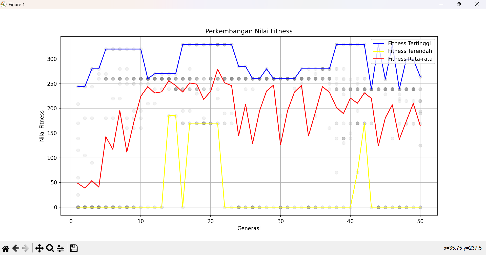

# Praktikum KB - Pertemuan 9: Algoritma Genetika untuk Knapsack Problem

**NIM:** H1D024013  
**Nama:** Melysa Ayu Wulan Sari  

---

## 1. Tentang Modul

Modul ini membahas Algoritma Genetika (AG) untuk optimasi. Tujuan: memahami AG dan menerapkannya pada Knapsack Problem.

---

## 2. Teori Singkat

Algoritma Genetika dikembangkan oleh John Holland (1960-an). Langkah-langkah:

1. **Inisialisasi** - Populasi awal acak (kromosom biner 0/1)
2. **Evaluasi Fitness** - Hitung total nilai barang, penalti jika melebihi kapasitas
3. **Seleksi** - Pilih orang tua (Roulette Wheel / Tournament)
4. **Crossover** - Gabung dua orang tua menjadi anak
5. **Mutasi** - Ubah sedikit gen untuk menjaga keragaman
6. **Generasi baru** - Ulangi langkah 2-5 sampai konvergen

**Knapsack Problem:** Pilih barang dengan total nilai maksimal, total bobot ≤ kapasitas tas. Kromosom: [1,0,1,...] (1 = barang dipilih).

---

## 3. Struktur File Proyek

- `InisiasiPopulasi.py` - membangkitkan populasi awal
- `EvaluasiFitness.py` - fungsi hitung fitness dengan penalti
- `selection.py` - seleksi parent (Roulette & Tournament)
- `crossover.py` - crossover (One-Point, Two-Point, Uniform)
- `mutation.py` - mutasi (Swap, Inversion, Uniform)
- `main.py` - program utama (GA loop + plotting)
- `grafik.png` - grafik hasil running
- `README.md` - penjelasan 

---

## 4. Cara Menjalankan

**Prasyarat:** Python 3.7+, library matplotlib, numpy.

Instal library:
pip install matplotlib numpy

**Eksekusi:**
1. Letakkan semua file `.py` dalam satu folder
2. Buka terminal di folder tersebut
3. Jalankan: `python main.py`

---

## 5. Parameter yang Digunakan (dalam `main.py`)

- `jumlah_generasi = 50` (jumlah iterasi evolusi)
- `jumlah_populasi = 20` (jumlah individu per generasi)
- `prob_crossover = 0.5` (peluang crossover)
- `prob_mutasi = 0.1` (peluang mutasi per gen)
- `kapasitas_tas = 50` (maksimal bobot tas)

---

## 6. Data Barang (9 Barang)

- Barang1 : nilai 60, bobot 10
- Barang2 : nilai 100, bobot 20
- Barang3 : nilai 120, bobot 30
- Barang4 : nilai 90, bobot 25
- Barang5 : nilai 69, bobot 11
- Barang6 : nilai 70, bobot 9
- Barang7 : nilai 80, bobot 15
- Barang8 : nilai 90, bobot 10
- Barang9 : nilai 25, bobot 3

---

## 7. Hasil Running

### a. Grafik Perkembangan Fitness

**Penjelasan Grafik:**
- Sumbu X = Generasi (1-50)
- Sumbu Y = Nilai Fitness (total nilai barang terpilih)
- Garis biru = Fitness tertinggi
- Garis kuning = Fitness terendah
- Garis merah = Rata-rata fitness
- Titik abu-abu = Semua individu (semakin gelap semakin banyak)

**Interpretasi:**
- Awal generasi: fitness rendah dan tersebar (eksplorasi)
- Tengah generasi: fitness naik drastis
- Akhir generasi: garis mendatar (konvergen ke solusi optimal)

### b. Output Teks (Contoh)

Setelah grafik ditutup, terminal menampilkan:
- Nilai Fitness Terbaik: 329
- Total Bobot: 50
- Barang Terpilih:
- Barang2
- Barang5
- Barang6
- Barang8

**Penjelasan:** Fitness 329 = total nilai barang terpilih. Total bobot = 20+11+9+10 = 50 (pas).

---

## 8. Catatan

- Hasil setiap run bisa berbeda karena sifat random GA.
- Untuk hasil konsisten, tambah `random.seed(42)` di awal `main.py`.
- Jika konvergensi belum tercapai, perbanyak `jumlah_generasi`.

